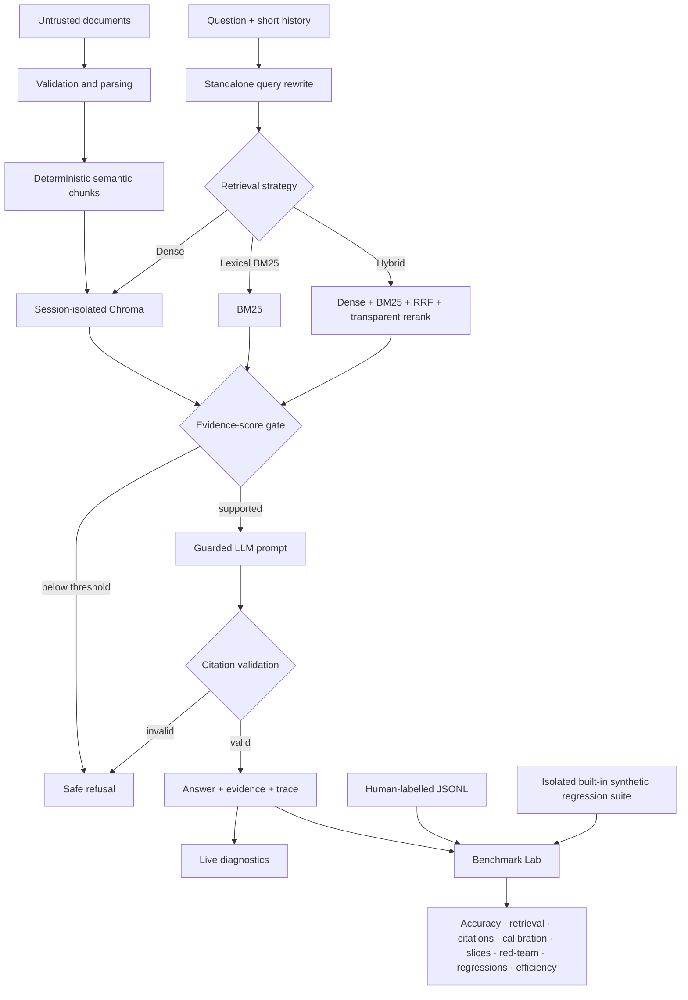

# VeriRAG Studio

**Ask the document. Inspect the proof. Measure the system.**

VeriRAG Studio is a bounded, auditable conversational RAG application and evaluation workbench. It ingests PDF, DOCX, TXT, Markdown, and CSV files; retrieves page-aware evidence; refuses weakly supported questions; validates generated source IDs; captures an auditable trace; and includes labelled benchmarking, calibration, retrieval/chunking ablations, red-team QA, model comparison, regression gates, and efficiency telemetry.

> The original concept says “Zero Hallucinations.” No probabilistic system can honestly guarantee that. VeriRAG instead makes unsupported answers harder to produce, visible when they occur, and measurable in evaluation.

## What changed in v0.2

VeriRAG v0.2 moves from “RAG with observability” toward a measurable RAG engineering platform.

- **Multiple retrieval strategies:** choose dense retrieval, lexical BM25, or hybrid dense + BM25 retrieval. Dense remains the shipped default until labelled evaluation demonstrates a better strategy for the target corpus.
- **Transparent reranking:** hybrid mode combines dense similarity, BM25, reciprocal-rank fusion, query-term coverage, and phrase-match signals without introducing another hosted model.
- **Label-derived gate calibration:** sweep the evidence-score gate and select a threshold from answerability labels instead of treating `0.40` as universally correct. Calibrate each retrieval strategy separately because its score semantics differ.
- **Retrieval ablations:** compare dense vs lexical vs hybrid, Top-K values, and evidence gates without paying for generation.
- **Chunking ablations:** re-index the built-in public benchmark corpus into temporary isolated collections and compare chunk size / overlap combinations.
- **Built-in regression/red-team suite:** 150+ curated synthetic cases cover answerable questions, safe refusals, conversational coreference, multi-document/versioned policies, and prompt-injection evidence. It is explicitly **not** a substitute for human-labelled domain gold.
- **Human-gold benchmark:** uploaded labelled JSONL remains the source of truth for real domain accuracy.
- **Confidence calibration:** ECE, Brier score, reliability curve, and confidence failure categories.
- **Failure taxonomy:** retrieval misses, wrong refusals, answer mismatches, citation misses, query-rewrite drift, overconfidence, underconfidence, and latency regression.
- **Regression gate:** compare benchmark runs with metric-specific degradation tolerances.
- **Model comparison:** run the same labelled cases across multiple model IDs supported by the configured provider.
- **Efficiency telemetry:** capture latency percentiles and provider token usage; estimate cost only when explicit per-million-token prices are configured.
- **Dataset slices:** inspect performance by tags such as `red-team`, `safe-refusal`, `conversational`, `multi-document`, `promotion`, `security`, and others.

## Core product controls

- **Evidence before generation:** the LLM is not called for an answer unless retrieval crosses a configurable evidence-score gate.
- **Session isolation:** every browser session uses a separate Chroma collection, and the built-in benchmark uses a second isolated collection so regression data cannot mix with user documents.
- **Prompt-injection resistance:** retrieved text is treated as untrusted evidence and fenced away from system instructions.
- **Citation integrity:** generation uses structured claim-to-source mappings; every rendered factual bullet receives validated IDs such as `[S1]`, with one bounded repair before safe refusal.
- **Conversational retrieval:** short-history follow-ups are rewritten to a standalone question, and rewrite fallback is recorded in the trace.
- **Page-aware ingestion:** PDF pages and source metadata remain attached to deterministic chunks.
- **Bounded resource use:** upload, page, file, CSV-row, context, and session-chunk limits protect free hosting tiers.
- **Dual inference:** Groq for hosted inference or Ollama for local inference.

## Architecture



## Quick start

Python 3.11 or 3.12 is recommended.

```bash
python -m venv .venv
# Windows: .venv\Scripts\activate
source .venv/bin/activate
python -m pip install -r requirements.txt
cp .env.example .env
streamlit run app.py
```

Choose one provider:

```bash
# Hosted mode
export VERIRAG_PROVIDER=groq
export GROQ_API_KEY=your_key

# Local mode
export VERIRAG_PROVIDER=ollama
ollama pull llama3.2:3b
```

Streamlit Community Cloud users should put `GROQ_API_KEY` in the app's secret/environment configuration. Never commit it.

## How evaluation works

VeriRAG deliberately separates **live diagnostics** from **ground-truth evaluation**.

### 1. Diagnostics — no labels required

The **Diagnostics** tab reports runtime signals such as:

- citation coverage;
- citation-ID validity;
- query-term coverage using the standalone conversational query;
- context-precision proxy against the configured evidence gate;
- retrieval / generation / total latency;
- optional model-based faithfulness auditing.

These are observability signals, not accuracy. A high retrieval score or 100% citation coverage does not prove the answer is correct.

### 2. Benchmark Lab — labels required for accuracy

The **Benchmark Lab** can use either:

1. **your human-labelled JSONL** — the appropriate source of truth for domain accuracy; or
2. **VeriRAG's built-in curated synthetic regression suite** — useful for repeatable engineering QA, security drills, and ablations, but not a production-accuracy claim.

The built-in corpus is indexed in its own session-isolated Chroma collection and therefore cannot contaminate documents loaded in **Ask & verify**.

A full labelled run measures:

- overall correctness and answerability accuracy;
- answerable/unanswerable confusion matrix;
- safe-refusal precision, recall, and F1;
- answer exact match and deterministic token F1;
- retrieval Recall@K and MRR against labelled chunks or source documents;
- citation precision, recall, and F1 against labelled evidence;
- conversational standalone-query token F1;
- confidence calibration using ECE and Brier score;
- deterministic failure taxonomy;
- red-team, safe-refusal, conversational, and other dataset slices;
- P50/P95 latency and token telemetry;
- run history, ablation comparison, and regression gates.

### 3. Retrieval-only experiments

Calibration and retrieval ablations do not need generation. That means you can cheaply answer questions such as:

- Is hybrid retrieval actually better than dense-only?
- Does Top-K 6 improve Recall@K enough to justify more context?
- Which evidence-score gate best separates answerable from unanswerable cases for each retrieval strategy?
- Does a smaller chunk size improve retrieval?
- Does the transparent reranker help or hurt?

Retrieval-only experiments use the labelled `expected_standalone_query` where available to isolate retrieval quality from query-rewrite quality. Full benchmark runs use the actual conversational rewrite path.

### 4. Model comparison

Enter multiple model IDs supported by the configured provider and run the same labelled subset against each. Results are stored as ordinary benchmark runs, so accuracy, citations, calibration, latency, tokens, and regressions can be compared directly.

## Gold JSONL schema

Minimum unanswerable example:

```json
{"case_id":"unsupported-001","query":"What is the CEO's name?","expected_answerable":false}
```

Answerable example:

```json
{"case_id":"window-001","query":"What is the frozen-food promotional window?","expected_answerable":true,"expected_answer":"The frozen-food promotional window runs from 15 October 2026 through 28 November 2026.","expected_source_docs":["promo_policy_2026.txt"],"tags":["promotion","date"]}
```

Conversational rewrite example:

```json
{"case_id":"followup-001","query":"What does the policy say about that?","expected_answerable":true,"expected_source_docs":["promo_policy_2026.txt"],"expected_standalone_query":"When does the frozen-food promotional window run?","history":[{"role":"user","content":"I am reviewing the promotion policy."}],"tags":["conversational","coreference"]}
```

Prefer `expected_chunk_ids` over `expected_source_docs` when exact chunk-level labels exist.

## Red / blue-team design

The built-in suite includes malicious evidence text that attempts to override application instructions. Blue-team controls are tested by asking legitimate questions about the same document and verifying that the system answers from factual evidence rather than obeying the embedded command. The deterministic test suite also verifies that the malicious instruction remains in the untrusted evidence/user channel and never enters the system prompt. The benchmark additionally checks safe refusal, outdated/current policy conflicts, conversational ambiguity, and multi-document retrieval.

The application still has explicit security boundaries: it is a public portfolio demo, not a certified environment for secrets, regulated data, or confidential enterprise documents.

## Regression strategy

Every benchmark run is exportable as JSON. Import earlier runs to compare a baseline with a candidate. The regression gate protects quality metrics such as accuracy, retrieval recall, citation F1, refusal F1, rewrite quality, ECE/Brier, and latency using metric-specific tolerances.

A future change should not be called an improvement merely because one demo question looks better.

## Run quality checks

```bash
python -m pip install -e '.[dev]'
ruff check .
pytest --cov=core --cov-report=term-missing --cov-fail-under=75
```

The automated suite uses deterministic fakes and does not require live provider calls.

## Configuration

| Variable | Default | Purpose |
|---|---:|---|
| `VERIRAG_PROVIDER` | `groq` | `groq` or `ollama` |
| `GROQ_MODEL` | `openai/gpt-oss-120b` | Hosted generation model |
| `OLLAMA_MODEL` | `llama3.2:3b` | Local generation model |
| `VERIRAG_EMBEDDING_MODEL` | `sentence-transformers/all-MiniLM-L6-v2` | FastEmbed model |
| `VERIRAG_RETRIEVAL_MODE` | `dense` | Safe shipped default; `dense`, `lexical`, or `hybrid` |
| `VERIRAG_SIMILARITY_THRESHOLD` | `0.40` | Historical env name for evidence-score gate; calibrate per strategy |
| `VERIRAG_TOP_K` | `4` | Evidence passages shown to the LLM |
| `VERIRAG_HYBRID_DENSE_WEIGHT` | `0.60` | Dense share of hybrid base score |
| `VERIRAG_RERANK_WEIGHT` | `0.20` | Transparent reranker contribution |
| `VERIRAG_RRF_K` | `60` | Reciprocal-rank fusion constant |
| `VERIRAG_CHUNK_SIZE_CHARS` | `1800` | Ingestion chunk size |
| `VERIRAG_CHUNK_OVERLAP_CHARS` | `220` | Ingestion overlap |
| `VERIRAG_MAX_FILE_MB` | `5` | Per-file upload ceiling |
| `VERIRAG_MAX_CHUNKS` | `1500` | Per-session memory ceiling |
| `VERIRAG_MAX_CONTEXT_CHARS` | `16000` | Maximum evidence prompt size |
| `VERIRAG_INPUT_COST_PER_MILLION_USD` | `0` | Optional explicit input-token price |
| `VERIRAG_OUTPUT_COST_PER_MILLION_USD` | `0` | Optional explicit output-token price |

Scores are retrieval-strategy and corpus dependent. The shipped `0.40` is a starting point for dense retrieval, not a universal optimum and not automatically transferable to lexical or hybrid retrieval.

## Repository map

```text
app.py                              Streamlit state and page orchestration
components/evidence_panel.py        Evidence presentation
components/eval_dashboard.py        Label-free live diagnostics
components/gold_eval_dashboard.py   Benchmark Lab UI
core/config.py                      Validated runtime settings
core/ingestion.py                   Parsers, normalization, and chunking
core/retrieval.py                   BM25, RRF and transparent reranking
core/vector_store.py                Dense / lexical / hybrid retrieval
core/providers.py                   Groq/Ollama adapters + token telemetry
core/rag_engine.py                  Retrieval gate and guarded generation
core/citations.py                   Bounded citation parsing and normalization
core/evaluator.py                   Transparent label-free diagnostics
core/gold_eval.py                   Ground-truth evaluation and calibration
core/benchmark_lab.py               Ablations, slices, red-team summary, regression gate
core/builtin_benchmark.py           Public curated synthetic regression corpus and labels
sample_evals/                       Human-gold template
tests/                              Unit/regression tests with no live model calls
```

## Security and privacy boundaries

- Uploaded bytes are processed in memory and are not intentionally written to disk.
- Collections are ephemeral and session-scoped, but a public Streamlit host is not a certified confidential-document environment.
- The built-in benchmark uses a separate session-isolated collection and is deleted when the session is reset.
- File extension checks, decompression bounds, and resource limits reduce risk; they are not a substitute for malware scanning in a regulated deployment.
- Benchmark uploads can contain sensitive labels or expected answers; treat them with the same caution as source documents.
- Token cost is not guessed from provider marketing pages. It is shown only when explicit rates are configured.
- Never upload secrets, personal data, contracts, or protected information to the public demo.

## License

MIT © 2026 Mohit Bhatnagar
