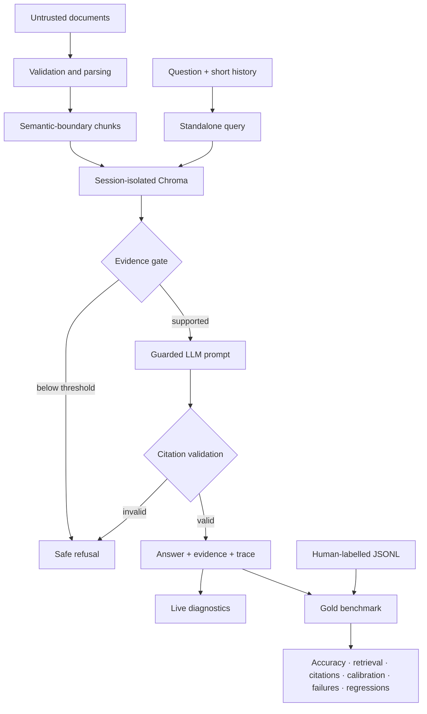

# VeriRAG Studio

**Ask enterprise documents. Inspect the proof.**

VeriRAG Studio is a bounded, auditable retrieval-augmented generation application. It ingests PDF, DOCX, TXT, Markdown, and CSV files; retrieves page-aware evidence; refuses weakly supported questions; validates generated source IDs; and exposes the complete retrieval trace in a dual executive/technical interface.

> The original concept says “Zero Hallucinations.” No probabilistic system can honestly guarantee that. This implementation instead makes unsupported answers harder to produce, visible when they occur, and measurable in evaluation.

## Product highlights

- **Evidence before generation:** the LLM is not called for an answer unless retrieval crosses a configurable similarity gate.
- **Session isolation:** every browser session uses a separate Chroma collection, avoiding cross-user document leakage on a public demo.
- **Prompt-injection resistance:** retrieved text is treated as untrusted evidence and fenced away from system instructions.
- **Citation integrity:** generation uses structured claim-to-source mappings; every rendered bullet receives validated IDs such as `[S1]`, with one recovery attempt before a safe refusal.
- **Conversational retrieval:** short-history follow-ups are rewritten to a standalone search question, and rewrite fallback is captured in the audit trace.
- **Gold-grounded evaluation:** labelled JSONL benchmarks measure answerability accuracy, retrieval recall/MRR, citation correctness, rewrite quality, calibration, failure modes, ablations and regressions.
- **Page-aware ingestion:** PDF pages and source metadata remain attached to deterministic chunks.
- **Bounded resource use:** upload, page, file, CSV-row, context, and session-chunk limits protect free hosting tiers.
- **Dual inference:** Groq for a public demo or Ollama for local/offline use.

## Architecture



The cached embedding model and Chroma client are shared infrastructure. Collections are named with random session IDs, so user documents are not shared.

## Quick start

Python 3.11 or 3.12 is recommended.

```bash
python -m venv .venv
# Windows: .venv\Scripts\activate
source .venv/bin/activate
python -m pip install -r requirements.txt
cp .env.example .env
streamlit run app.py
```

Choose one provider:

```bash
# Public/free-tier mode
export VERIRAG_PROVIDER=groq
export GROQ_API_KEY=your_key

# Local mode
export VERIRAG_PROVIDER=ollama
ollama pull llama3.2:3b
```

Streamlit Community Cloud users should put `GROQ_API_KEY` in the app's secret/environment configuration. Never commit it.

## Evaluation model

VeriRAG now deliberately separates two kinds of evaluation:

### 1. Live diagnostics — no labels required

The **Diagnostics** tab reports transparent runtime signals such as:

- citation coverage;
- citation-ID validity;
- query-term coverage using the standalone conversational query;
- context-precision proxy against the configured similarity gate;
- retrieval / generation / total latency;
- optional model-based faithfulness auditing.

These are diagnostics, not accuracy. Empty retrieval has no context-precision denominator and is therefore reported as N/A rather than 100%.

### 2. Gold benchmark — human labels required

The **Gold benchmark** tab accepts JSONL examples and runs the current RAG pipeline against them. It measures:

- overall correctness and answerability accuracy;
- answerable/unanswerable confusion matrix;
- safe-refusal precision, recall and F1;
- answer exact match and deterministic token F1 when a reference answer is supplied;
- retrieval recall@K and mean reciprocal rank (MRR) against labelled chunk IDs or source documents;
- citation precision, recall and F1 against labelled evidence;
- conversational standalone-query token F1 when a rewrite target is supplied;
- evidence-confidence calibration using Expected Calibration Error (ECE) and Brier score for released factual answers;
- deterministic failure taxonomy;
- labelled run history, ablation comparison and regression alerts.

A sample file is available at `sample_evals/gold_template.jsonl`.

### Gold JSONL schema

Minimum unanswerable example:

```json
{"case_id":"unsupported-001","query":"What is the CEO's name?","expected_answerable":false}
```

Answerable example with reference answer and evidence:

```json
{"case_id":"window-001","query":"What is the frozen-food promotional window?","expected_answerable":true,"expected_answer":"The standard promotional window begins on 15 October 2026 and ends on 28 November 2026.","expected_source_docs":["retail_promotion_policy.txt"]}
```

Conversational rewrite example:

```json
{"case_id":"followup-001","query":"What restrictions apply to it?","expected_answerable":true,"expected_source_docs":["retail_promotion_policy.txt"],"expected_standalone_query":"What restrictions apply to the early booking incentive?","history":[{"role":"user","content":"What is the early booking incentive?"}]}
```

Prefer `expected_chunk_ids` over `expected_source_docs` when exact chunk-level labels exist. A benchmark can issue multiple LLM calls and consume provider quota. Do not upload confidential labelled data to the public demo.

## Run quality checks

```bash
python -m pip install -e '.[dev]'
ruff check .
pytest -q
```

## Configuration

| Variable | Default | Purpose |
|---|---:|---|
| `VERIRAG_PROVIDER` | `groq` | `groq` or `ollama` |
| `GROQ_MODEL` | `openai/gpt-oss-120b` | Groq production generation model |
| `OLLAMA_MODEL` | `llama3.2:3b` | Local generation model |
| `VERIRAG_EMBEDDING_MODEL` | `sentence-transformers/all-MiniLM-L6-v2` | FastEmbed model |
| `VERIRAG_SIMILARITY_THRESHOLD` | `0.40` | Minimum top cosine similarity |
| `VERIRAG_TOP_K` | `4` | Evidence passages shown to the LLM |
| `VERIRAG_MAX_FILE_MB` | `5` | Per-file upload ceiling |
| `VERIRAG_MAX_CHUNKS` | `1500` | Per-session memory ceiling |
| `VERIRAG_MAX_CONTEXT_CHARS` | `16000` | Maximum evidence prompt size |

Similarity scores are model- and corpus-dependent. Use the labelled benchmark to calibrate the threshold before consequential use.

## Repository map

```text
app.py                              Streamlit state and page orchestration
components/evidence_panel.py        Evidence presentation
components/eval_dashboard.py        Label-free live diagnostics
components/gold_eval_dashboard.py   Labelled benchmark, history and regressions
core/config.py                      Validated runtime settings
core/ingestion.py                   Parsers, normalization, and chunking
core/vector_store.py                Session-isolated Chroma access
core/providers.py                   Groq and Ollama adapters
core/rag_engine.py                  Retrieval gate and guarded generation
core/citations.py                   Bounded citation parsing and normalization
core/evaluator.py                   Transparent label-free diagnostics
core/gold_eval.py                   Ground-truth evaluation and calibration
sample_evals/                       Gold benchmark examples/templates
tests/                              Unit tests with no live model calls
```

## Security and privacy boundaries

- Uploaded bytes are processed in memory and are not intentionally written to disk.
- Collections are ephemeral and session-scoped, but a public Streamlit host is not a certified confidential-document environment.
- File extension checks, decompression bounds, and resource limits reduce risk; they are not a substitute for malware scanning in a regulated deployment.
- Benchmark uploads can contain sensitive labels or expected answers; treat them with the same caution as source documents.
- Never upload secrets, personal data, contracts, or protected information to a public demo.

## License

MIT © 2026 Mohit Bhatnagar
