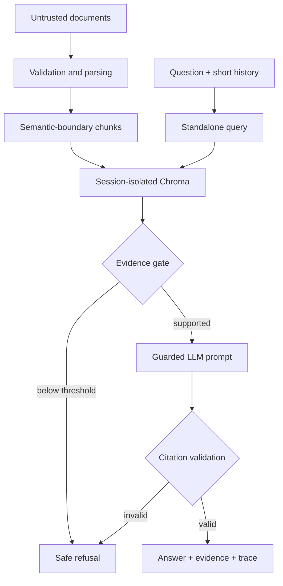

# VeriRAG Studio

**Ask enterprise documents. Inspect the proof.**

VeriRAG Studio is a bounded, auditable retrieval-augmented generation application. It ingests PDF, DOCX, TXT, Markdown, and CSV files; retrieves page-aware evidence; refuses weakly supported questions; validates generated source IDs; and exposes the complete retrieval trace in a dual executive/technical interface.

> The original concept says “Zero Hallucinations.” No probabilistic system can honestly guarantee that. This implementation instead makes unsupported answers harder to produce, visible when they occur, and measurable in evaluation.

## Product highlights

- **Evidence before generation:** the LLM is not called for an answer unless retrieval crosses a configurable similarity gate.
- **Session isolation:** every browser session uses a separate Chroma collection, avoiding cross-user document leakage on a public demo.
- **Prompt-injection resistance:** retrieved text is treated as untrusted evidence and fenced away from system instructions.
- **Citation integrity:** every factual sentence or bullet must cite supplied IDs such as `[S1]`; a structured claim-to-source repair is attempted once before a failed validation triggers a safe refusal.
- **Page-aware ingestion:** PDF pages and source metadata remain attached to deterministic chunks.
- **Bounded resource use:** upload, page, file, CSV-row, context, and session-chunk limits protect free hosting tiers.
- **Dual inference:** Groq for a public demo or Ollama for local/offline use.

## Architecture



The cached embedding model and Chroma client are shared infrastructure. Collections are named with random session IDs, so user documents are not shared.

## Quick start

Python 3.11 or 3.12 is recommended.

```bash
python -m venv .venv
# Windows: .venv\Scripts\activate
source .venv/bin/activate
python -m pip install -r requirements.txt
cp .env.example .env
streamlit run app.py
```

Choose one provider:

```bash
# Public/free-tier mode
export VERIRAG_PROVIDER=groq
export GROQ_API_KEY=your_key

# Local mode
export VERIRAG_PROVIDER=ollama
ollama pull llama3.2:3b
```

Streamlit Community Cloud users should put `GROQ_API_KEY` in the app's secret/environment configuration. Never commit it.

## Run quality checks

```bash
python -m pip install -e '.[dev]'
ruff check .
pytest -q
```

## Configuration

| Variable | Default | Purpose |
|---|---:|---|
| `VERIRAG_PROVIDER` | `groq` | `groq` or `ollama` |
| `GROQ_MODEL` | `openai/gpt-oss-120b` | Groq production generation model |
| `OLLAMA_MODEL` | `llama3.2:3b` | Local generation model |
| `VERIRAG_EMBEDDING_MODEL` | `sentence-transformers/all-MiniLM-L6-v2` | FastEmbed model |
| `VERIRAG_SIMILARITY_THRESHOLD` | `0.40` | Minimum top cosine similarity |
| `VERIRAG_TOP_K` | `4` | Evidence passages shown to the LLM |
| `VERIRAG_MAX_FILE_MB` | `5` | Per-file upload ceiling |
| `VERIRAG_MAX_CHUNKS` | `1500` | Per-session memory ceiling |
| `VERIRAG_MAX_CONTEXT_CHARS` | `16000` | Maximum evidence prompt size |

Similarity scores are model- and corpus-dependent. Calibrate the threshold against labelled in-domain and out-of-domain questions before consequential use.

## Repository map

```text
app.py                       Streamlit state and page orchestration
components/                  Evidence and diagnostics presentation
core/config.py               Validated runtime settings
core/ingestion.py            Parsers, normalization, and chunking
core/vector_store.py         Session-isolated Chroma access
core/providers.py            Groq and Ollama adapters
core/rag_engine.py           Retrieval gate and guarded generation
core/citations.py            Bounded citation parsing and normalization
core/evaluator.py            Transparent deterministic diagnostics
tests/                       Unit tests with no live model calls
```

## Security and privacy boundaries

- Uploaded bytes are processed in memory and are not intentionally written to disk.
- Collections are ephemeral and session-scoped, but a public Streamlit host is not a certified confidential-document environment.
- File extension checks, decompression bounds, and resource limits reduce risk; they are not a substitute for malware scanning in a regulated deployment.
- Never upload secrets, personal data, contracts, or protected information to a public demo.

## License

MIT © 2026 Mohit Bhatnagar
